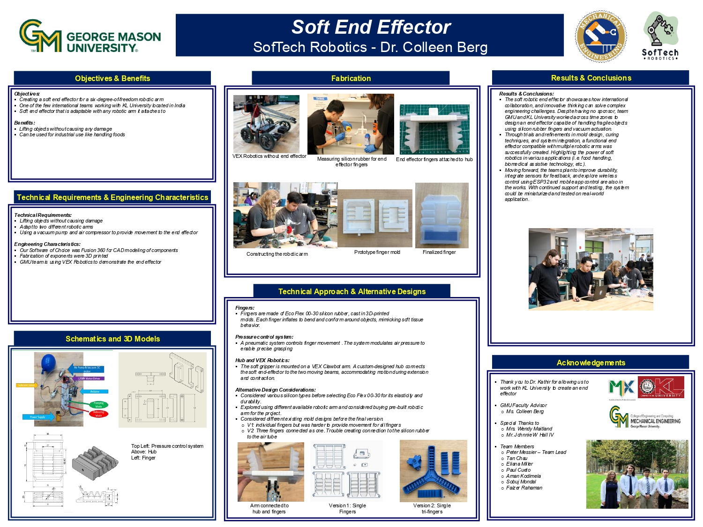

# Title
Soft End Effector Project GMU Side

## Objective
To design and build a soft robotic end effector capable of grasping delicate objects for aquatic research and other sensitive tasks.

## Description
This project involves the development of a soft, flexible, and sensor-integrated end effector for a 6 DOF robotic arm. It emphasizes lightweight materials, adaptive grasping techniques, and water-resistant features.

## Images
Here are some visuals that support the project:

*Overview of the VEX Robotic design.*

*Draft poster of project progress*

## Conclusion
The project demonstrates the feasibility of soft robotic grasping for sensitive applications. Future improvements may include feedback and enhanced waterproofing for underwater use.

